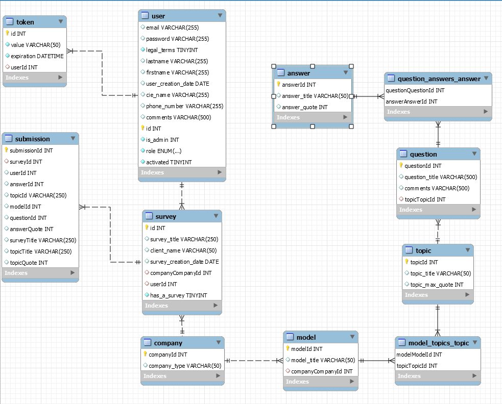

# CYBERDIAG : What is it ? How does it work ?

This app is used to create a first cyber-security diagnostic for compagnies or consultants working in insurance (for instance) and filling the surveys with the clients.

# TECH

Dillinger uses a number of open source langages to work properly:

* [Typescript](https://www.typescriptlang.org/)
* [Typeorm](https://typeorm.io/#/)
* [JWT](https://jwt.io/)- used for to create token
* [Argon 2](https://www.npmjs.com/package/argon2)- used to encrypt password
* [Nodemailer](https://nodemailer.com/about/) _ used to send an email when the user creates a profile
* [Express](http://expressjs.com/) - fast node.js network app framework [@tjholowaychuk]
* [Express router](https://expressjs.com/fr/guide/routing.html)- allows to manage routes
* [Reflect metadata](https://www.npmjs.com/package/reflect-metadata)- adds support for metadata in TypeScript
* [Body parser](https://www.npmjs.com/package/body-parser) - allows you to maintain the data posted by a form for example.


# INSTALLATION 

1. Create an empty database MySql named "Cyberdiag"
2. Clone reposirory
3. Install dependencies 
```sh
Npm install
```
4. Configuration

All datas for connection are in src/config.
- config-db.ts : Create link with database.
Ex : export const DATABASE = { host: 'localhost', username: 'root', password: 'password', database: 'DatabaseName', };
- jwt-secret.ts : initialise  json web token (jwt).
Ex : export const JWT_SECRET = 'azerTYTYUIOP12693193';

You can choose to put the config in the gitignore file.

4. Run 
```sh
npm run start:dev
```

All the tables (rntities) will be created when the server is launched.


# How does Typeorm work ?
TypeORM is an ORM that can run in NodeJS, Browser, Cordova, PhoneGap, Ionic, React Native, NativeScript, Expo, and Electron platforms and can be used with TypeScript and JavaScript (ES5, ES6, ES7, ES8). Its goal is to always support the latest JavaScript features and provide additional features that help you to develop any kind of application that uses databases - from small applications with a few tables to large scale enterprise applications with multiple databases.

1. ENTITIES

The tables are generated when  the server is launched.
More details about [entities](https://typeorm.io/#/).
More explainations:
- @ => are decorator fields, like @PrimaryGeneratedColumn which is the Primary Key, or @Column which are the fields of the table. For a user entity, it will be id, name, firstname, etc.
- Type => inidcates type of value for ORM.
- id!:number =>indicates type of value for typescript (respect the syntax with exclamation mark).
- Nullable : true => Indicates if a field can be empty or not.
- @ManyToOne /@OneToMany /@ManyToMany : Indicates what can of relations link two tables, and generates the foreign keys.

When an entity is created, it has to be added in the file loaders/typeorm.

2. REPOSITORY

The repository is the link between entities and the entities and typeorm.


3. SERVICES
We find in the services all the Js logic to create the http requests.

For example for an entity named Question
```
export class QuestionService {
  private repository = getCustomRepository(QuestionRepository);

  async getAll() {
    return await this.repository.find({ relations: ["topic"] });
  }
}
```

- private repository => available only in this service
- getCustomRespository => intern typeorm method to create the link with the QuestionRespository.
- async function which returns the repository.
- .find()=>typeorm method to get all the datas. There are more methods like .findOne(), .save(),.update()
- ({relations :[topic"]})=> As the Topic and Question entities are linked thanks to a ManyToOne/OneToMany link, precise the relation in the service will allow to have all the datas from Question entity AND from Topic entity (the result is a nested json).

4. CONTROLLERS

The controllers will use the services to create the routes for the different http requests.
It will determine the name of the different paths for the different requests.

5. CONTROLLERS / SERVICES REDUNDANCY
It is possible to break this redundancy and ugly code repetition by using "abstract.services" or "common_functions.controller" which will handle all similar cases. For example, any "getAll()" or "getById()", etc, required by our application.

So if you ask yourself the question of avoiding writing redundant code, it's possible with abstracts.

6. THE CORE
It contains as specified above the abstracts or the commons controllers but also the db.handler which is like the guarantor of the management of errors between typeorm and Mysql. As well as the environment.ts which is used to return, in this case, to the Vuejs app at the time of user registration (auth part).

7. INDEX.TS
It is present at the root and allows you to retrieve the different controllers in order to "execute" them when it starts. They also import loaders.

# AUTHENTIFICATION

A new user is created thanks to atuh service and controller.

1. Auth Service
There are basically two methods. A signin & a signup that manage the login & account creation. We encrypt(hash) the password with argon2. Once the password is "encrypted", it is stored for a variable length of time in the "Token" table.

Once activated, and at the moment of connecting, the "encrypted" password is compared with the one present in the "Users" database. If it matches, you can log in, otherwise there is a problem entering the password.

2. Account activation
When a user creates a new account, an email (via nodemailer) is sent directly to the console (for the moment there is no "real" mail sent). 
So open the console in VSCode, and you'll find a link to follow to activate the new account.
Once it is done, the account changes from "ghost" to "user" by default. If you set the is_admin field to 1, it will automatically switch from "ghost" to "admin".

3. How to create a user in postman ?
On Postman, at http://localhost:3000 /register via a POST method. You enter the following fields in the Body > x.www.form-urlencoded : name, email, password

Check the link in the VSCode console and the new user will be created.

4. How to log in in Postman ?
Go to http://localhost:3000 /login, enter the fields in the Body > x.www.form-urlencoded :
email, password.

If it is correct, the result will be a json with "auth":true.
If not, there will be a error message